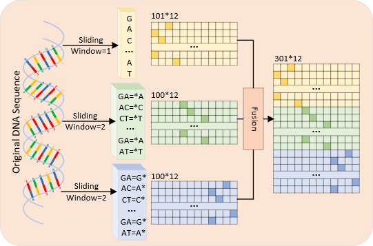
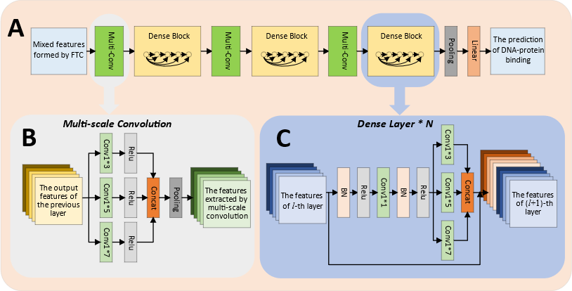

# MSDenseNet

<div align=center>

<p align="center"><b>Figure 1. </b>Graphical illustration of the coding mechanism of FTC</p>
</div>

<div align=center>

<p align="center"><b>Figure 2. </b>The architecture of MSDenseNet</p>
</div>


# Dependencies

MSDenseNet is work under Python 3.8.
The required dependencies for MSDenseNet are in requirements.txt file.

torchvision==0.9.1  
pandas==1.2.3  
numpy==1.20.2           
torch==1.8.1  
scikit_learn==0.24.2  
tensorboard==2.8.0  
```
pip install -r requirements.txt
```

# Training MSDenseNet on cell datasets

If you want to train this model on cell datasets, you need to download the cell datasets (see the dataset section) to `Dataset/cell_dataset` folder.

```
python train_on_cell_datasets.py
```
## Output:

The models will save in `checkpoint` folder, the prediction results and the log file will save in `runs` folder, and metric results will save in `cell_datasets_result` folder.


# Training MSDenseNet on 690 ChIP-seq datasets

## Option 1: Training MSDenseNet on global dataset
you need to download the global dataset (see the dataset section) to `Dataset/global_dataset` folder.
```
python train_on_global_dataset.py
```
### Output:
The models will save in `checkpoint` folder, the prediction results and the log file will save in `runs` folder, and metric results will save in `Global_datasets_result` folder.

## Option 2: Training MSDenseNet on 690 datasets
you need to download the 690 ChIP-seq datasets (see the dataset section) to `Dataset/690_dataset` folder.
```
python transform_on_690datasets.py
```
### Output:
The models will save in `checkpoint_transfer` folder, the prediction results and the log file will save in `runs_transfer` folder, and metric results will save in `690_datasets_result` folder.


# Data
Data (train, validation and test) used for training MSDenseNet model can be downloaded from:
http://csbio.njust.edu.cn/bioinf/msdensenet/datasets.html
Uncompress these datasets to `Dataset` folder.
```
Dataset
├── 690_dataset     <-    Transfer learning Datasets
│	├── wgEncodeAwgTfbsBroadDnd41CtcfUniPk
│	│	├── test.data
│	│	├── train.data
│	│	└── valid.data
│	├── ...
│	...
├── cell_dataset    <-    Cell line Datasets (A549, H1hesc, Huvec, Mcf7 forder)
│	├── A549
│	│	├── test.data
│	│	├── train.data
│	│	└── valid.data
│	├── ...
│	...
└── global_dataset  <-    Global training Datasets (train.data, valid.data, test.data)
    ├── test.data
    ├── train.data
    └── valid.data
```
## Contact:
[Yu-Hang Yin](https://github.com/yinyh-1997/MSDenseNet): yyh@stu.just.edu.cn <br>
Long-Chen Shen: shenlc1995@njust.edu.cn <br>
Dong-Jun Yu: njyudj@njust.edu.cn <br>
Jiangning Song: jiangning.song@monash.edu

